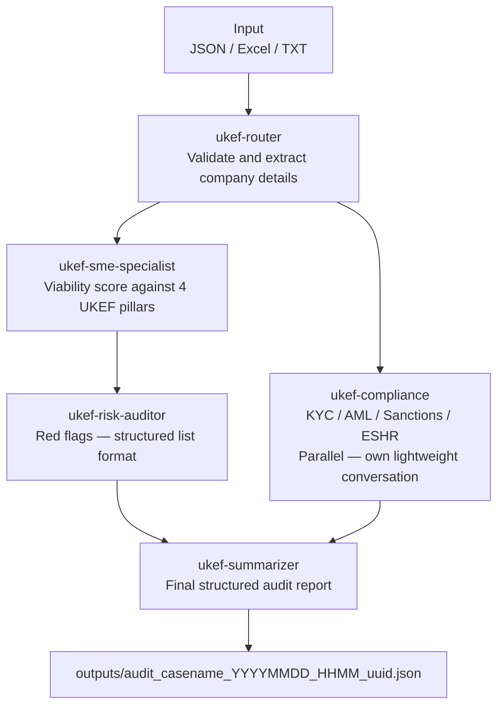

# UKEF AI Credit Audit Pipeline

AI-powered credit audit pipeline built on Azure AI Foundry for UK Export Finance.

---

## What it does

Takes a company case file (JSON, Excel, or text) and runs it through 5 specialist AI agents to produce a structured credit audit report with recommendation, viability score, red flags, compliance status and required documents.

Each audit runs in a **fresh Foundry conversation** — agents share a persistent context thread so the Summarizer reads the full conversation history automatically, with no cross-contamination between cases.

---

## Pipeline Flow



Compliance runs **in parallel** with SME + Risk on its own lightweight conversation (case data only). This avoids large payload failures and reduces total run time.

---

## Input

Place case files in one of two folders:

| Folder | Format | Example |
|---|---|---|
| `inputs/JSON/` | JSON case file | `case_BridgePower.json` |
| `inputs/M365/` | Excel (`.xlsx`) or text | `BridgePower_Ltd_data.xlsx` |

Excel files are read via `openpyxl` — all sheets extracted as tab-separated text. Temporary lock files (`~$`) are automatically excluded from the menu.

### Case file structure (JSON)

| Section | What it contains |
|---|---|
| `company` | Name, employees, turnover, sector, structure |
| `finance_request` | Facility type, amount, purpose, repayment source |
| `additionality` | Banks approached, outcome, evidence of market failure |
| `export_plan` | Target markets, contracts, pipeline value |
| `strategic_pillars` | Clean growth, supply chain, regional impact |
| `financials` | EBITDA, debt, credit rating |
| `compliance` | KYC, sanctions, AML, PEP status |

---

## Output

Each audit saves to `outputs/` with a timestamp and short UUID — previous runs are never overwritten:

```
outputs/audit_case_BridgePower_20260502_1158_bb8064.json
```

Contains all 5 agent responses: `router`, `sme`, `risk`, `compliance`, `summary`.

---

## Architecture — MSLearn Foundry Pattern

This pipeline was refactored based on the **Microsoft Learn Exercise 01: Build AI Agents with Portal and VS Code**, which teaches the Foundry Agents v2 pattern using the Responses API.

### What we learned

| Concept | Old approach | MSLearn pattern (current) |
|---|---|---|
| Agent lookup | Hardcoded name + version dict | `project_client.agents.get(agent_name=...)` at boot |
| State management | Stateless — manual string concatenation | `openai_client.conversations.create()` — one conversation per case |
| Passing context | Giant prompt strings stitched together | Conversation history carries context automatically |
| Boot validation | None — failures discovered mid-run | All 5 agents validated upfront, abort if any missing |
| Compliance payload | 4,500+ tokens → 500 server errors | 850 tokens — parallel lightweight conversation |

### How it works now

1. **Boot** — `init_agents()` calls `project_client.agents.get()` for all 5 agents and confirms they exist in Foundry. Aborts immediately if any are missing.
2. **Per case** — a fresh `conversation` is created via `openai_client.conversations.create()`, seeded with the case JSON once
3. **Router** — runs first, validates intake, result added to main conversation
4. **Fork (parallel)** — two threads start simultaneously:
   - Thread A: SME → Risk (sequential, main conversation — context builds naturally)
   - Thread B: Compliance (own lightweight conversation with case only — avoids large payload 500 errors)
5. **Rejoin** — compliance result injected into main conversation
6. **Summarizer** — reads the full conversation history automatically, no manual concatenation needed
7. **Token monitoring** — every agent call prints `[agent-name] Tokens — in: X  out: Y` for live visibility. Thread output is locked to prevent interleaving.

One conversation per case = no hallucination leak between audits.

### Observed token counts (BridgePower / GreenTech runs)

| Agent | Tokens In | Tokens Out | Notes |
|---|---|---|---|
| ukef-router | ~810 | ~1,000 | Case JSON only |
| ukef-compliance | ~850 | ~900 | Lightweight parallel conv |
| ukef-sme-specialist | ~990 | ~3,000 | Main conv + router |
| ukef-risk-auditor | ~5,000 | ~10,000 | Main conv + router + SME |
| ukef-summarizer | ~31,000 | ~6,000 | Full conversation |

---

## How to run

```
python pipeline/pipeline.py                  # interactive menu
python pipeline/pipeline.py BridgePower      # run one case by name
python pipeline/pipeline.py all              # run all cases
```

On startup the pipeline validates all 5 agents are reachable in Foundry and prints their IDs. If any agent is missing it aborts before spending tokens on the audit.

---

## Tuning the Risk Auditor

The `ukef-risk-auditor` agent produces a structured pipe-separated list:

```
Flag name  |  Risk level (H/M/L)  |  One-line mitigation
```

To adjust verbosity: edit the agent instructions in the Foundry portal, test in the playground, then sync:

```
python sync_agents.py
git add agents/
git commit -m "Tune risk auditor instructions"
```

---

## Sync agents from Foundry

When you change an agent in Foundry, run:

```
python sync_agents.py
git add agents/
git commit -m "Sync agents from Foundry"
git push
```

---

## Project structure

```
agents/             YAML for all 8 Foundry agents (synced via sync_agents.py)
inputs/
  JSON/             JSON case files
  M365/             Excel and text case files
outputs/            Audit results — timestamped, never overwritten
pipeline/
  pipeline.py       Main pipeline
sync_agents.py      Pulls agent YAMLs from Foundry
README.md           This file
.env                Azure credentials (never committed)
.gitignore          Excludes .env, .venv, outputs
```

---

## Agents

| Agent | Purpose | Model | Tools |
|---|---|---|---|
| ukef-router | Intake validation | model-router-1 | — |
| ukef-sme-specialist | Viability against 4 UKEF pillars | model-router-1 | — |
| ukef-risk-auditor | Red flags — structured list | model-router-1 | — |
| ukef-compliance | KYC / AML / Sanctions / ESHR | model-router-1 | — |
| ukef-summarizer | Final audit report | model-router-1 | — |
| ukef-financial | Financial health score | model-router-1 | Code interpreter |
| ukef-country-risk | Export market risk | model-router-1 | — |
| ukef-audit-master | Orchestrator | model-router-1 | File search |

---

## Setup

```
python -m venv .venv
.venv\Scripts\Activate.ps1
pip install azure-ai-projects>=2.0.0 python-dotenv pyyaml openpyxl
```

Create `.env`:
```
AZURE_AI_PROJECT_ENDPOINT=https://UKEF-Foundation-resource.services.ai.azure.com/api/projects/UKEF_Foundation
```

## Auth

`DefaultAzureCredential` everywhere — no keys in code.
Local: sign in via VS Code Azure extension.
